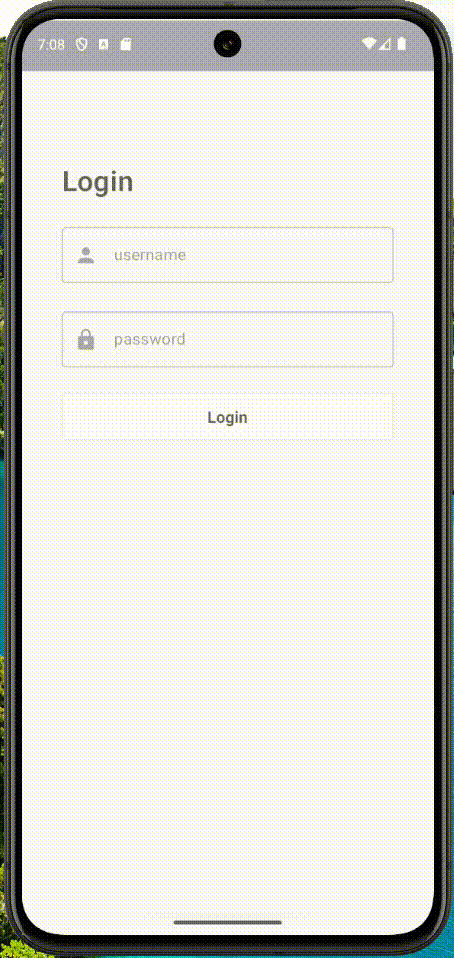

# Highlightor-Compose

[](https://jitpack.io/#fakhrirasyids/Highlightor-Compose)

## How to add

### Step 1
	dependencyResolutionManagement {
		repositoriesMode.set(RepositoriesMode.FAIL_ON_PROJECT_REPOS)
		repositories {
			mavenCentral()
			maven { url 'https://jitpack.io' }
		}
	}

### Step 2
	dependencies {
	        implementation 'com.github.fakhrirasyids:Highlightor-Compose:v0.0.1'
	}

## Preview
|  | 
| :---:                              | 
|   |

## Usage

### Step 1

Wrap your compose content with Highlightor function, then inside the HighlightorScope, add the **Modifier.highlightor()** in the composables that want to be highlighted.

``` kotlin
    var showHighlightor by remember {
        mutableStateOf(true)
    }

    Highlightor(showHighlightor = showHighlightor, onCompleted = { showHighlightor = false }) {
        Column {
            Text(
                text = "Check",
                modifier = Modifier
                    .highlightor(
                        index = 0,
                        description = "This is check text."
                    )
            )
```

### Step 2

Adjust the index parameter to the desired displaying order.

``` kotlin
            ...
            Text(
                text = "Check",
                modifier = Modifier
                    .highlightor(
                        index = 0,
                        description = "This is check text."
                    )
            )
            Text(
                text = "Test",
                modifier = Modifier
                    .highlightor(
                        index = 2,
                        description = "This is test text."
                    )
            )
            Text(
                text = "Add",
                modifier = Modifier
                    .highlightor(
                        index = 1,
                        description = "This is add text."
                    )
            )
            ...
```
